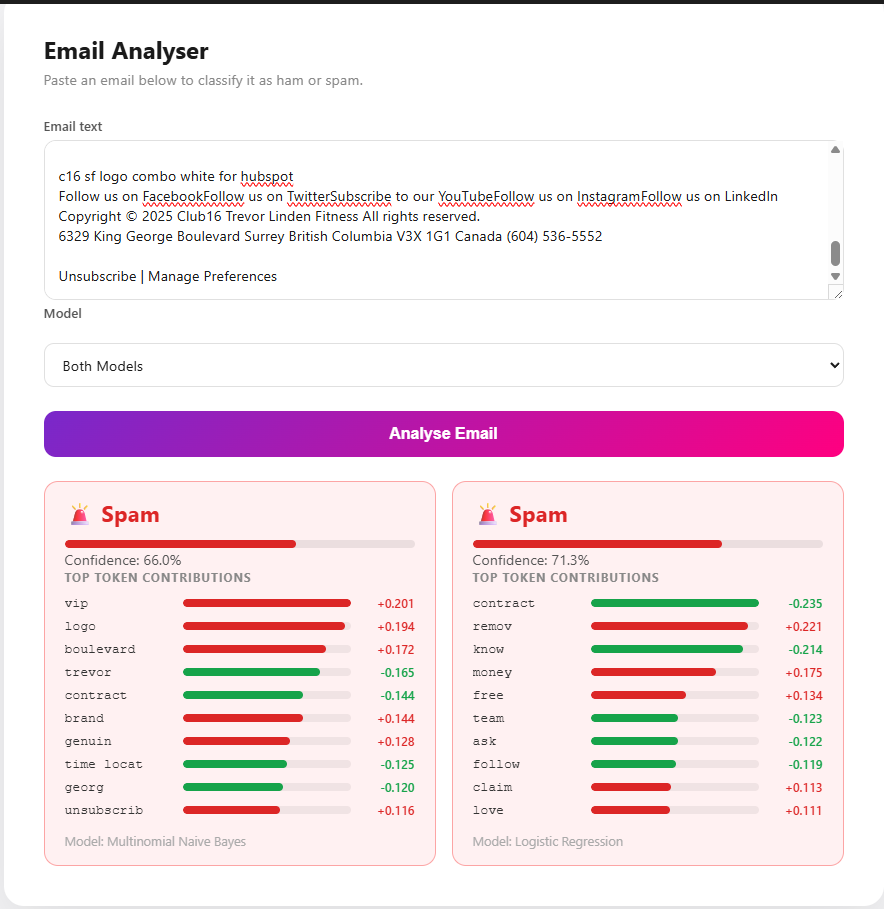
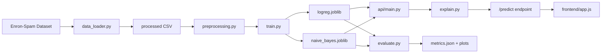

# email-spam-classifier

A spam classifier trained on the [Enron-Spam dataset](http://www2.aueb.gr/users/ion/data/enron-spam/) (Metsis, Androutsopoulos & Paliouras, CEAS 2006) using TF-IDF features with Logistic Regression and Multinomial Naive Bayes. Served via a FastAPI REST API with per-prediction explainability and an interactive browser frontend.



## Features

- Two classifiers — Logistic Regression and Multinomial Naive Bayes — both achieving ~98.3% accuracy
- TF-IDF with Porter stemming, bigrams, and URL/email token replacement
- FastAPI prediction endpoint with confidence scores and top contributing tokens
- Interactive frontend with animated loading screen, confidence meter, and token contribution chart
- Side-by-side comparison mode: run both models on the same email simultaneously
- EDA notebook with class balance, text length, top-word, and word-cloud plots
- Full evaluation report: confusion matrix, PR curves, and per-class metrics
- Docker support — single-container deployment with models baked in
- GitHub Actions CI — lint, type check, and test on every push to main
- Auto-deploys on Render via `render.yaml`

## Architecture



The pipeline runs in three phases: data preparation, training and evaluation, and serving via the API and frontend.

## Setup

**Requirements:** Python 3.13+

```bash
# Create and activate a virtual environment
python -m venv .venv
.venv\Scripts\activate        # Windows
source .venv/bin/activate     # macOS / Linux

# Install dependencies
pip install -r requirements.txt
```

## Quick Start

### 1. Download the dataset

```bash
python -m src.data_loader
```

Downloads and extracts the six Enron-Spam tarballs (~50 MB compressed, ~200 MB after extraction) to `data/raw/` and caches a combined CSV to `data/processed/enron_spam.csv`.

### 2. Train the models

```bash
python -m src.train
```

Trains Logistic Regression and Multinomial NB on enron1–5, tests on enron6, and saves three artifacts to `models/`:

| File | Contents |
|---|---|
| `logreg.joblib` | Fitted LogisticRegression pipeline |
| `naive_bayes.joblib` | Fitted MultinomialNB pipeline |
| `train_test_split.joblib` | Train/test split arrays and metadata |

### 3. Evaluate the models

```bash
python -m src.evaluate
```

Prints classification reports to stdout and saves to `reports/`:
- `eval_confusion_matrix.png` — side-by-side confusion matrices
- `eval_pr_curve.png` — precision-recall curves for both models
- `metrics.json` — numeric results (accuracy, precision, recall, F1, PR AUC)

### 4. Start the API

```bash
python -m uvicorn api.main:app --host 0.0.0.0 --port 8000
```

- Frontend: `http://localhost:8000`
- Interactive API docs: `http://localhost:8000/docs`

### 5. Run with Docker (alternative)

```bash
docker compose up --build
```

Models are baked into the image at build time. The API is available at `http://localhost:8000`.

## Frontend

The browser UI is served directly by the API at `http://localhost:8000`. It requires no separate build step.

- **Loading screen** — animated gradient with a "Check Email" entry button
- **Dashboard** — paste email text, choose a model, click Analyse
- **Results** — classification label, animated confidence bar, and a per-token contribution chart
- **Both Models mode** — select "Both Models" in the dropdown to run both classifiers in parallel and compare results side by side

## API Reference

### `POST /predict`

Classify an email and return the top contributing tokens.

**Request body**

```json
{
  "text": "Congratulations! You have won a $1,000,000 prize...",
  "model": "naive_bayes"
}
```

| Field | Type | Default | Values |
|---|---|---|---|
| `text` | string | required | any non-empty string |
| `model` | string | `"naive_bayes"` | `"naive_bayes"`, `"logreg"` |

**Response**

```json
{
  "label": "spam",
  "confidence": 0.9998,
  "model": "naive_bayes",
  "top_tokens": [
    { "token": "prize", "score": 2.341 },
    { "token": "congratul", "score": 1.872 }
  ]
}
```

> Note: Tokens are returned in their stemmed form (e.g., "congratulations" → "congratul") because the model operates on stemmed features.

```bash
curl -X POST http://localhost:8000/predict \
  -H "Content-Type: application/json" \
  -d '{"text": "Congratulations! You have won a free iPhone!", "model": "naive_bayes"}'
```

Positive token scores indicate spam signals; negative scores indicate ham signals.

## Project Structure

```
email-spam-classifier/
├── .github/
│   └── workflows/
│       └── ci.yml              # GitHub Actions: lint, type check, test
├── api/                        # FastAPI application
│   ├── main.py
│   ├── model_loader.py
│   └── schemas.py
├── data/
│   ├── raw/                    # Downloaded tarballs (git-ignored)
│   └── processed/              # Cached CSV (git-ignored)
├── frontend/                   # Static browser UI
│   ├── index.html
│   ├── style.css
│   └── app.js
├── models/                     # Saved .joblib files
├── notebooks/
│   └── 01_eda.ipynb            # Exploratory data analysis
├── reports/                    # Plots and metrics output
├── src/
│   ├── data_loader.py          # Dataset download and parsing
│   ├── preprocessing.py        # Text cleaning and pipeline factory
│   ├── train.py                # Training script
│   ├── evaluate.py             # Evaluation script
│   └── explain.py              # Token-level explainability
├── tests/                      # pytest test suite
├── Dockerfile
├── docker-compose.yml
└── render.yaml                 # Render deployment config
```

## Model Comparison

Both models were trained on enron1–5 (27,716 emails) and evaluated on enron6 (6,000 emails) — a held-out subset collected from a different user's inbox to test cross-user generalization.

| Metric | Logistic Regression | Multinomial NB |
|---|---|---|
| Accuracy | 98.27% | 98.27% |
| Ham precision | 0.984 | 0.966 |
| Ham recall | 0.946 | 0.965 |
| Spam precision | 0.982 | 0.988 |
| Spam recall | 0.995 | 0.989 |
| PR AUC | 0.9977 | 0.9994 |
| False positives (ham → spam) | 81 | 53 |
| False negatives (spam → ham) | 23 | 51 |

### Which model is better?

The accuracy is identical, but the error profiles are different:

- **Logistic Regression** is the aggressive spam catcher. It misses very few spam emails (only 23 slipped through), but it incorrectly flags 81 real emails as spam — that's 5.4% of legitimate mail. In a real inbox, users would lose work emails to the spam folder.
- **Multinomial NB** is more balanced: 53 false positives, 51 false negatives. It lets slightly more spam through but protects legitimate mail better.

For a deployed spam filter where losing a real email is far worse than seeing one extra spam, **Naive Bayes is the better choice on this dataset**. The API defaults to it, but Logistic Regression is available via the `model` parameter for cases where catching spam is the higher priority.

NB also has a slight edge in PR AUC (0.9994 vs 0.9977), meaning it ranks examples better across thresholds and gives more flexibility for threshold tuning.

### Caveats

- The test set is 75% spam (1,500 ham / 4,500 spam), which is the opposite of a typical inbox. Per-class precision and recall are the honest measures of real-world behavior; overall accuracy alone is misleading at this class balance.
- NB is known to produce poorly calibrated probabilities — confidence scores tend to cluster near 0 or 1 even when the model is uncertain. The confidence value from the API should be read as "which class is more likely," not as a literal probability.
- Training takes ~64 seconds per model, almost entirely spent in `TfidfVectorizer.fit_transform`. The classifiers themselves train in under a second.

## Future Improvements

- Fine-tune DistilBERT for comparison against the TF-IDF baseline
- Add adversarial spam examples (homoglyphs, leet speak) to the test set
- Track model drift in production with a feedback endpoint
- Replace bag-of-words explainability with sentence embeddings

## Running Tests

```bash
pytest tests/ -v
```

The suite covers preprocessing edge cases (empty strings, HTML, unicode), explainability output structure, and end-to-end API behavior via FastAPI's TestClient.

## Deployment

### Render

Connect the repository on [render.com](https://render.com) — Render auto-detects `render.yaml` and configures the service. No manual setup required.

### Docker

```bash
docker compose up --build
```

The image uses `python:3.13-slim` and bakes all model files in at build time, so the container needs no external data source at runtime.

## License

MIT — see [LICENSE](LICENSE).

## Author

**Akshit Jindal** — [akshitjindal77@gmail.com](mailto:akshitjindal77@gmail.com)